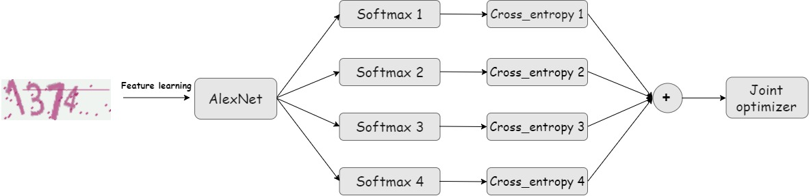

# Captcha_Recognition


### Description
A machine-learning way to recognize captcha images automatically.For detaled inormation please refer to my report under reports folder.
Below is the network structure of our designed model:

Here are some captions generated by this model:



### Prerequisites(libraries)
* **Python version 3.6**
* **Tensorflow** ([instructions](https://www.tensorflow.org/install/))
* **Captcha** ([instructions](https://pypi.org/project/captcha/))  
```shell
        $ pip install --user captcha   
```

### Preparation
We have already converted the training and testing set into TFRecord foramt. Also, we saved a trained network for test. Download these files under the instructions below.
* **dataset:** Download the converted dataset [here](https://drive.google.com/open?id=1lpGNj1n2t2b__wdD6-tUxx2DDx9sxgaa) and put it in the folder  `captcha`, unzip the file with: 
```shell
        $ unzip tfrecords.zip   
```
* **trained model:** Download the trained model [here](https://drive.google.com/open?id=1fR-dka8ImcndCi_f24TatHjqgbg3mnKX) and put it in the folder  `captcha/models`, unzip the file with: 
```shell
        $ unzip trained-model.zip   
```

### Usage/Code orgnization
* **Generateing_captcha.ipynb:** Generating different captcha image set with different character combinations: numbers only, numbers+lower-characters, number+lower+upper chracters.  


